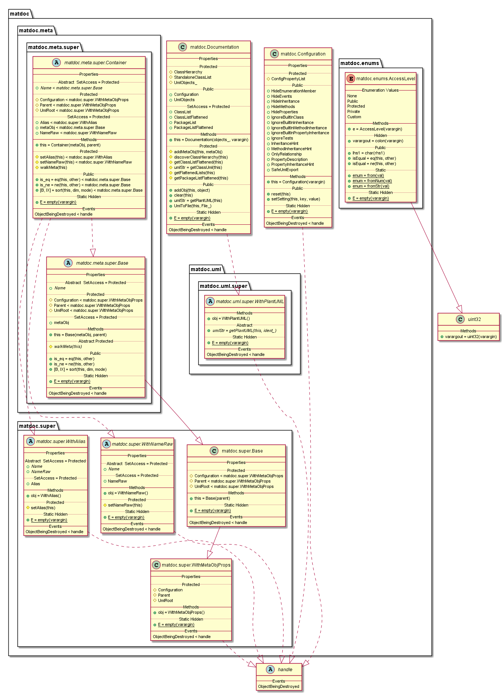

# Welcome to matdoc!

matdoc is a package to deliver solutions to document your matlab code more automaded.

## Main Features

* Export of **[plantUML](http://www.plantuml.com)** pseudo code for classes and packages

## Installation / Deployment

Clone and add the root folder to the matlab search path.

## Usage

### Reading Classes and Packages

Before we can export and documentation or plantUML code, we need to define which classes or packages we want to document. This work is done by the Documentation class. Simply call it with a cellarray of class or package names you want to document. Here is an example:

```matlab
theDoc = matdoc.Documentation({...
   'matdoc.Configuration',... a class we want to document
   'matdoc.Documentation',... another class we want to document
   'matdoc.enums',... a package we want to document
   'matdoc.meta.super',... jet another package we want to document
    });
```

Now let's save the UML Diagram to a txt file of these 2 classes and the 2 packages and their containing classes:

```matlab
theDoc.UmlToFile('uml-diagram.txt');
```

The output can be seen here: **[uml-diagram.txt](doc/uml-examples/uml-diagram.txt)**

With a a plantUML editor of your choise (see chapter below) you can now create beatifull class diagrams:



## Configuration

The output will be configured via additional arguments to the [matdoc.Documentation](+matdoc/Documentation.m) constructor. The settings have to be passed as key value pairs.

```matlab
theDoc = matdoc.Documentation({...
   'matdoc.meta.Class',...
   'matdoc.enums.AccessLevel'...
    },...
    'IgnoreBuiltInClass', true...  <-- additional configuration arguments
    );
```

Alternatively the configuration may be edited directly via the properties of the config:

```matlab
theDoc = matdoc.Documentation({...
   'matdoc.meta.Class',...
   'matdoc.enums.AccessLevel'...
    });
theDoc.Configuration.IgnoreBuiltInClass = true;
```

For further reference about the available settings please have a look at the **[Configuration Examples](doc/Configuration-examples.md)**.

## Displaying plantUML

When it comes to displaying the produced **[plantUML](http://www.plantuml.com)** there are several options:

* Online Viewer
  - [planttext.com](https://www.planttext.com/)
  - [PlantUML Editor at kkeisuke.com](https://plantuml-editor.kkeisuke.com/)
* Local Installation
  - plantUML.jar from [plantuml.com](http://plantuml.com/download)<br /><br />
    *Make sure you have **[GraphViz](https://graphviz.gitlab.io/)** installed!
    And by installed I mean properly installed. Remember that you'll have to set the path variable in windows!*
  - **[plantuml-viewer](https://atom.io/packages/plantuml-viewer)** for the Atom editor
  
## Frequently Asked Questions (F.A.Q.)

See the **[F.A.Q. Section](doc/faq.md)**
